# Javascript

# PARTE 1: Explorando java script

1. para mi lo que diferencia a javascript de html y css es que html y css estan enfocados mas al diseño de la pagina y javascript a la funcionalidad de esta permitiendo crear interactividad con el usuario y no tener solo un visual

2. Funciones: Tiene funciones parecidas a las de python como los bloques de codigo reutilizables y condicionales.
   
Tipos de datos: Como en python tambien permite datos como numeros, cadenas y booleanos.

Compatibilidad: Es compatible con muchos navegadores web.

3. Que sea enfocado a eventos quiere decir que permite al usuario interactuar con eventos del navegador como cambios en el navegador o funciones y interpretado es que este es directamente traducido a codigo de lenguaje de maquina mediante un motor de javascript

# Parte 2: variables y tipos  de datos

### 2.1 Variable:
---

---
### 2.2 tipos de datos:
---
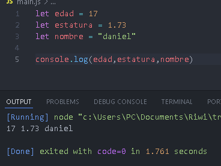
---
### 2.3: cambiar su valor
---
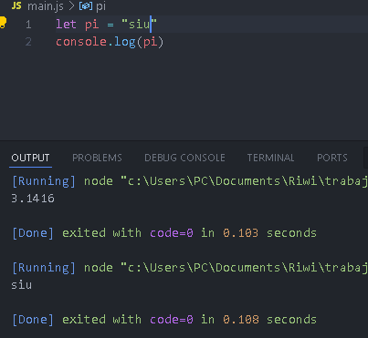
---
No pasa nada, si lo cambio a tipo cadena de texto sigue funcionando con tal de que tenga comillas
---
### 2.4: variable sin valor
---
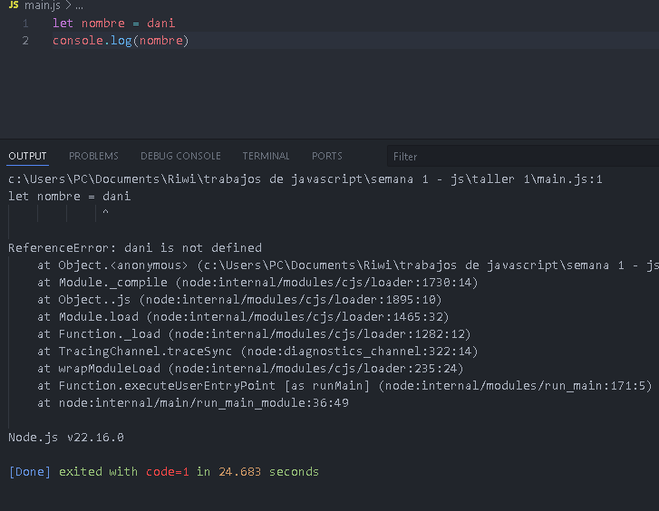
---
### 2.5: variable null:
---
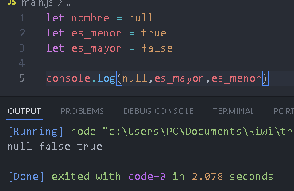
---
# parte 3: Entrada y salida de datos
---
### 3.1: usar prompt
---
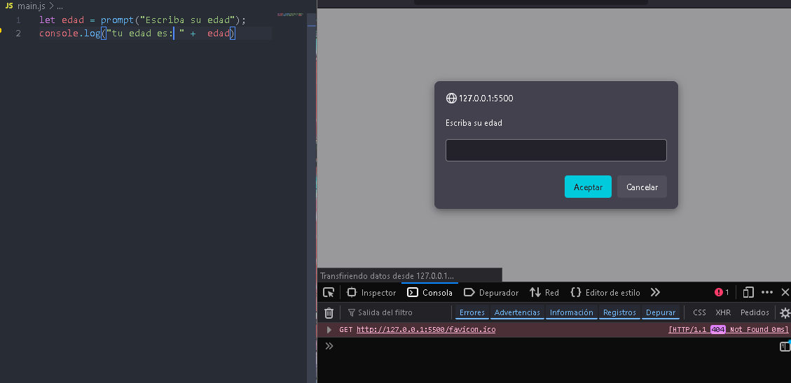
---
Me muestra el resultado en la consola del navegador
---
### 3.2: alert
---
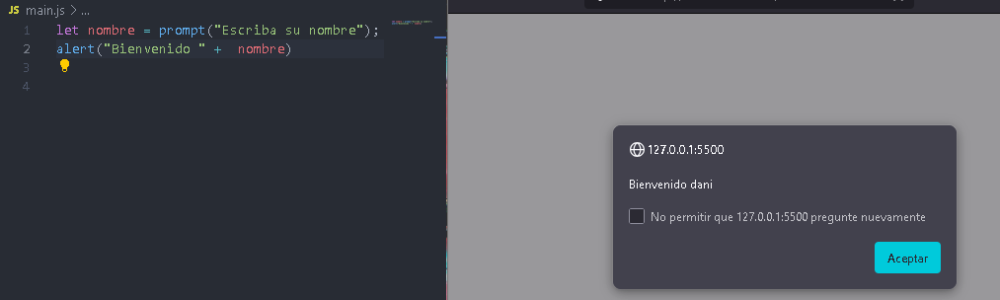
---
### 3.3: confirm
---
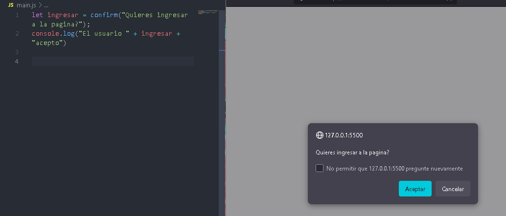
---
# parte 4: Operadores
---
### 4.1 operaciones aritmetricas
---
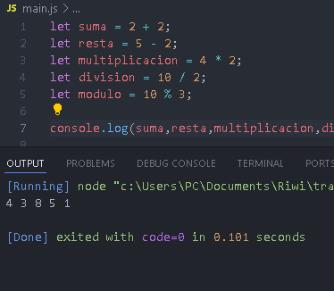
---
### 4.2 concatenacion
---
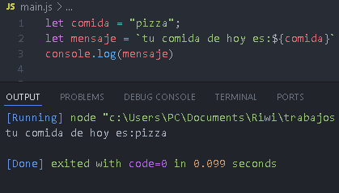
---
### 4.3
---
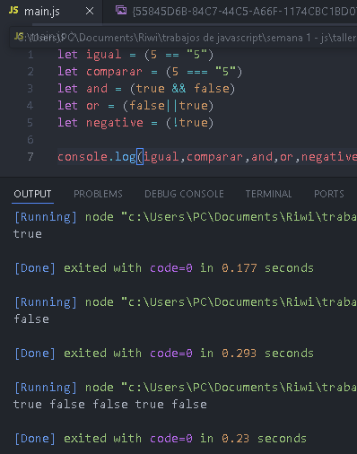
---
# parte 5: condicionales
---
### 5.1 mayor o menor que
---
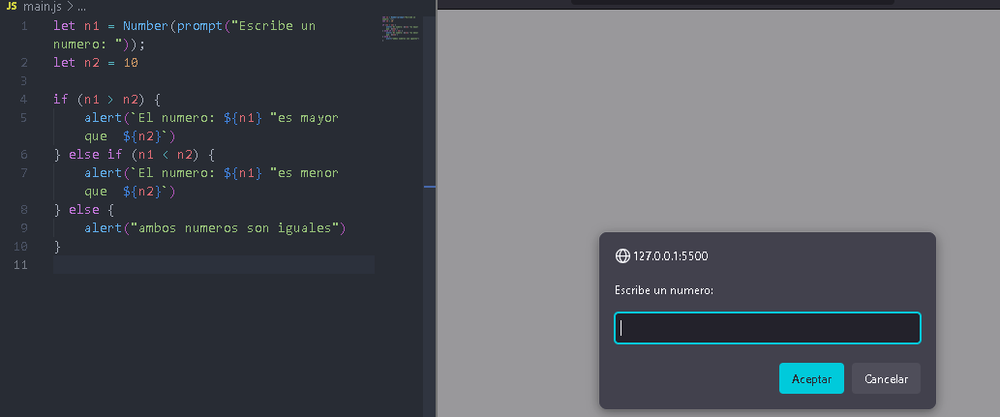
---
### 5.2 condiciones
---
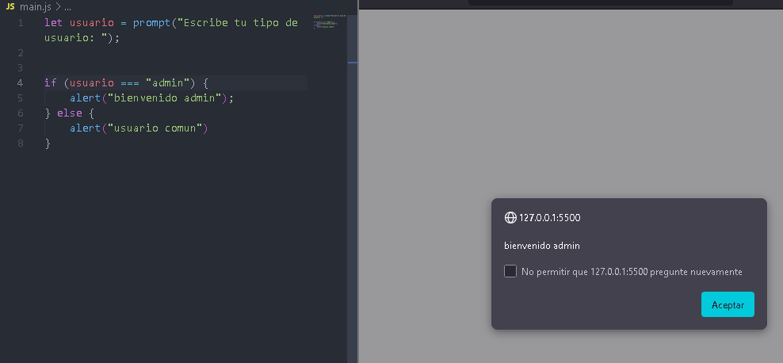
---
### 5.3 ternario
---
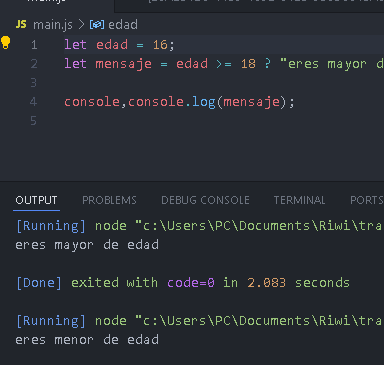
---
# parte 6: consola del navegador + parte 7: comentarios
---
### 6.1 consola del navegador 
---
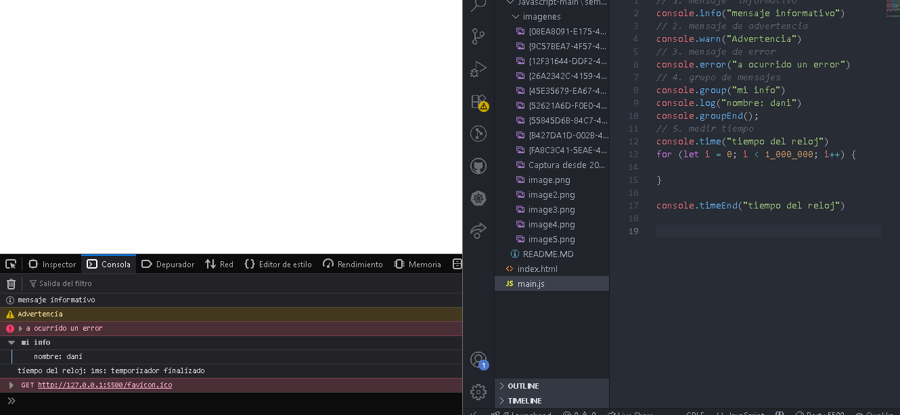
---
# parte 8: desafio final
---
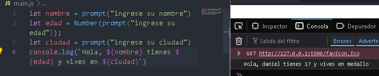
---